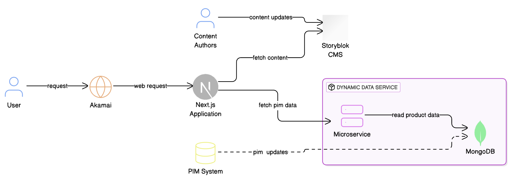

---

# Application Documentation

This document provides an overview of the application's architecture, key components, and development practices. The application leverages **Next.js** for the frontend, **Storyblok CMS** for static content management, and **Spring Boot APIs** for dynamic data.

---

## 1. Application Overview

### Tech Stack
- **Frontend**: Next.js (React-based framework)
- **CMS**: Storyblok (Headless CMS for static content)
- **Backend**: Spring Boot APIs (Dynamic data for products and recipes)

---

## 2. Architecture




### High-Level Overview
1. **Client**:
   - Sends requests to the Next.js server.
   - Pages are rendered statically or dynamically based on the request.

2. **Next.js Server**:
   - Handles routing, rendering, and API calls.
   - Fetches static content from Storyblok CMS.
   - Fetches dynamic data from Spring Boot APIs.

3. **Storyblok CMS**:
   - Manages static content like navigation, banners, and page layouts.
   - Provides reusable components for dynamic rendering.

4. **Spring Boot APIs**:
   - Supplies dynamic data for products, recipes, and related content.
   - Exposes REST endpoints for the frontend.

---

## 3. Key Components

### 3.1 Storyblok Integration
- **File**: `src/lib/storyblok.ts`
- Initializes the Storyblok API client and registers components for dynamic rendering.
- Example:
```typescript
import { apiPlugin, storyblokInit } from "@storyblok/react/rsc";

export const getStoryblokApi = storyblokInit({
  accessToken: process.env.STORYBLOK_TOKEN,
  apiOptions: { region: "us" },
  use: [apiPlugin],
  components: {
    page: Page,
    banner: Banner,
    grid: Grid,
    card: Card,
    promoTiles: PromoTiles,
    recipeList: RecipeList,
    hero: Hero,
  },
  enableFallbackComponent: true,
});
```

---

### 3.2 Dynamic Data Fetching
- Fetches dynamic data for products and recipes using Spring Boot APIs.
- Example:
```typescript
const fetchPageData = async (lang: string, slug: string) => {
  const productResponse = await fetch(`${process.env.API_BASE_URL}/api/products/${slug}`);
  const productData = await productResponse.json();

  const storyblokResponse = await getStoryblokApi().get(`cdn/stories/${lang}/${slug}`, {
    version: "published",
  });

  return { product: productData, story: storyblokResponse.data.story };
};
```

---

### 3.3 Dynamic Routing
- Dynamic routes are generated using the `generateStaticParams` function.
- Example:
```typescript
export async function generateStaticParams() {
  const response = await fetch(`${process.env.API_BASE_URL}/api/products`);
  const data = await response.json();

  return data.map((product: any) => ({ slug: product.slug }));
}
```

---

### 3.4 Static Content Management
- Storyblok CMS manages static content like navigation, banners, and page layouts.
- Example:
```typescript
const storyblokResponse = await getStoryblokApi().get(`cdn/stories/${lang}/${slug}`, {
  version: "published",
});
```

---

### 3.5 Component Structure
- Components are registered in `storyblok.ts` and are modular and reusable.
- Example:
```typescript
components: {
  page: Page,
  banner: Banner,
  grid: Grid,
  card: Card,
  promoTiles: PromoTiles,
  recipeList: RecipeList,
  hero: Hero,
}
```

---

### 3.6 Environment Variables
- Sensitive information like API keys and tokens are managed using environment variables.
- Example:
```plaintext
STORYBLOK_TOKEN=[your token]
NODE_ENV=[your environment name]
```

---

### 3.7 Global Navigation and Footer
- Navigation and footer are globally added in `layout.tsx` using `Header` and `Footer` components.
- Content is fetched from the Storyblok `site-config` page.
- Example:
```typescript
const { data } = await getStoryblokApi().get("cdn/stories/site-config", {
  version: "published",
});
```
---

---

### 3.8 Domain-Rewrites for application setup

The application uses domain-based URL rewrites to dynamically route requests to specific product directories without including the product name in the URL path. This is configured in the `next.config.js` file.

#### Example Rewrite Rule
The following rule checks if the request is coming from `ricekrispies.com` and rewrites it to the `/ricekrispies` path, allowing the application to serve content specific to that product without exposing the product name in the URL.
```javascript
{
  source: '/ricekrispies/:path*',
  has: [
    {
      type: 'host',
      value: 'ricekrispies.com',
    },
  ],
  destination: '/ricekrispies/:path*',
},
```

